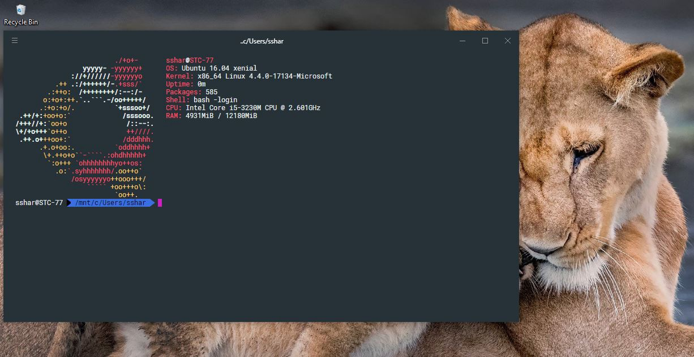

# Becoming a CNA Ninja 0: The Tools

## Intro

If, like me, until recently you were a sysadmin - probably with a little "coding" experience hacking Shell or PowerCLI scripts together as needed for your day-to-day tasks and your experience and interaction points for infrastructure systems was using a UI to send commands ad-hoc to hosts and management systems in an imperative manner.

This new world of containers and declaritive systems can seem daunting and arcane. Part of this is obviously rooted in the lack of proficiency or core, fundamental understanding of how things like containers, orchestrators, service meshes or CI/CD pipelines work or operate which is what this series aims to clear up.

There are no fancy UIs here, UIs slow you down and lack the ability to easily re-create steps without proneness to errors.

Additionally, imperative systems (ones that are built up from incremental changes over time) are almost impossible to re-create accurately. This makes declerative systems where the end-state is defined at the beginning extremely attractive, everything is repeatable - regardless of the operator and can be revision controlled and rolled back making ops much easier.

Some of the confusion, however, is lacking the correct tools and understanding of _how_ you are meant to interact with these new solutions. In a few words it comes down to this:

_Everything is CLI and config file driven._

## You will need

When working with CNA-type apps and systems there are a few programs that are invaluable:

* A package manager of your OS
* A terminal
* A text editor
* OS Packages
* A REST API client

I run macOS but the tooling doesn't vary much across OSes.

### Package Manager

The first thing on the list is a package manager - it's much easier to install and stay up to date with applications and binaries when you can invoke a simple `install` or `update` command from the CLI - nobody wants to Google, find the maintainer's website and download the latest release every time there is an update or new package needed. You will also find that the tooling for building and operating these systems relies on quite a few applications to be installed on your local machine, so getting this out of the way early makes a lot of sense.

On macOS I use [`brew`](https://brew.sh) as my package manager - `brew` is the ubiquitous package manager for macOS and can install compiled applications (`casks`) as well as applications that need to be built for your OS (`bottles`). I use it to manage all applications on my mac, even the GUI ones ([see my dotfiles repo](https://github.com/mylesagray/dotfiles/blob/master/brew.sh)).

#### macOS

Install `brew`

```sh
/usr/bin/ruby -e "$(curl -fsSL https://raw.githubusercontent.com/Homebrew/install/master/install)"
```

You can now install applications on your mac using the terminal `brew` command, like so:

```sh
brew install lolcat 
```

Try out the new app:

```sh
ls -l | lolcat -F 0.3
```

[](https://asciinema.org/a/224141)

Pretty cool, right? We will be using your package manager throughout this series to install necessary packages at each step, so it's best you get comfortable using it!

If you want to update your existing packages installed by `brew` just run a `brew update && brew upgrade`.

#### Windows

The leading package manager for Windows is [`Chocolatey`](https://chocolatey.org), it works in much the same way as `brew` for macOS above, in that you can install [pre-defined packages](https://chocolatey.org/packages) on your OS from the CLI as well as update them.

All of the packages we install with `brew` throughout this series with some notable exceptions (iTerm) should be available for install by `choco install` as well.

A useful one to test with is `wget`:

```sh
choco install wget
```

Test out `wget`:

```sh
wget google.com
```

There will be an `index.html` file in your current directory that is the Google homepage if it's all worked well.

#### Linux

Just use your built-in OS package manager - you probably already know what it is.

### Terminal

Given we will be spending _a lot_ of time in the terminal for this series and in general, having a good terminal that is customisable is a must for ease of use and general sanity. You might ask "What's wrong with the terminal that comes with my OS?". The answer is nothing - however extensibility of third part terminals is far beyond that of most built-in terminals.

#### macOS

I use [iTerm2](https://www.iterm2.com) on macOS, it has a ton of functionality and [customisation](https://medium.com/swlh/power-up-your-terminal-using-oh-my-zsh-iterm2-c5a03f73a9fb) built in and I find generally nicer to use than the built in `Terminal.app`.

While you're here, install it with `brew`:

```sh
brew install iterm2
```


Mine has been customised out of the box from the [above tutorial](https://medium.com/@ssharizal/hyper-js-oh-my-zsh-as-ubuntu-on-windows-wsl-terminal-8bf577cdbd97) to install a `zsh` shell, `oh-my-zsh` and custom fonts.

#### Windows

There is no `iTerm2` for Windows, but as of Windows 10 you can use the very cool `Windows Subsystem for Linux` (WSL) to use a Linux CLI on Windows - which will make doing things in this Linux-focused area much easier.

There is a great tutorial on setting up WSL as well as `Hyper.js` and a `zsh` shell [here](https://medium.com/@ssharizal/hyper-js-oh-my-zsh-as-ubuntu-on-windows-wsl-terminal-8bf577cdbd97).



#### Linux

There are a bunch of terminals for Linux, if you are already using Linux I will assume you like what you have and leave it at that - maybe use some of the above links for macOS and Windows for inspiration.

### Text Editor

Not to be underestimated is the power of a good text editor, particularly an extensible one that allows for plugins to be installed that further the functionality of the editor.

I was a die-hard [Sublime-Text](https://www.sublimetext.com) user for years, but recently a new cross-platform text editor has emerged from the unlikliest of sources and claimed the crown almost universally.

#### Visual Studio Code

[VSCode](https://code.visualstudio.com) for short, has gone from strength to strength and the community has really rallied behind this open-source editor from Microsoft. Not to be confused with vanilla "Visual Studio", VSCode is a much lighter-weight text editor that is extendable and user-friendly.

It has all kinds of cool features like syntax-highlighting, themeing, integrated terminals, git integration, debugging and a plethora of features that can be installed via the build in extension installer.


As I mentioned, VSCode is entirely cross-platform, so I recommend it for anyone looking for a robust text editor.

If you're on macOS you can install it with:

```sh
brew cask install visual-studio-code
```

##### Extensions

You can see the extensions i'm using above as a general guide but I will list the main ones below:

* Docker
* GitLens
* Go
* Kubernetes
* markdownlint
* One Dark Pro
* PowerShell
* Python
* Ruby
* Vagrant
* YAML

### OS Packages

Some base packages are good to have installed right off the bat as they will be used extensively as we go through this series for a variety of tasks. I will link to each of the packages so you can read about them separately if you want a better feel for what they do.

Use your package manager of choice to install the following:

* [Git](https://git-scm.com)
* [Docker](https://www.docker.com/products/docker-desktop)
* [Kubectl](https://kubernetes.io/docs/reference/kubectl/overview/)

On mac this is done like-so:

```sh
brew install git kubernetes-cli && brew cask install docker
```

Optionally, overwrite/install the built in utilities for [some](https://formulae.brew.sh/formula/coreutils) [base](https://formulae.brew.sh/formula/moreutils) [system](https://formulae.brew.sh/formula/findutils) [binaries](https://formulae.brew.sh/formula/bash-completion):

```sh
brew install bash-completion coreutils findutils moreutils
```

### REST API client

When working with systems like Docker, Kubernetes, cloud services we will be interacting with APIs a lot - additionally as we build a app out through the course of this series it will be implementing a [RESTful API](https://stackoverflow.com/questions/671118/what-exactly-is-restful-programming) - It makes life a lot easier if we can send requests to these API endpoints through an environment that allows us to set variables and set up workspaces, etc.

#### POSTman

[POSTman](https://www.getpostman.com/downloads/) is that application. It allows us to send arbitrary requests to API endpoints we define. It is cross-platform so is recommended for all and is a good visual alternative to the more traditional method of querying APIs with `curl` from the command line. Below is an example that queries the Twitter API for the first 1000 posts that contain the string `vExpert` and the [JSON](https://www.copterlabs.com/json-what-it-is-how-it-works-how-to-use-it/) reply.

POSTman is good for getting a visual idea of what data an API replies with, or how to interact with an API before you build it out programatically.


### Shell (Optional)

As you saw above in the [Terminal](#Terminal) section, the tutorials I linked to installed a shell called [`zsh`](https://unix.stackexchange.com/questions/72570/zsh-is-it-worth-the-switch-from-bash-is-it-the-time) and an overlay on to it called [`oh-my-zsh`](https://ohmyz.sh) that provides many built-in helper functions, plugins and themes. This is entirely optional but after some use you will see how powerful it is compared to a standard `bash` shell for interacting with directly.

On macOS you can install `zsh` and `oh-my-zsh` as well as `zsh` syntax highlighting with `brew`

```sh
brew install zsh
sh -c "$(curl -fsSL https://raw.githubusercontent.com/robbyrussell/oh-my-zsh/master/tools/install.sh)"
brew install zsh-syntax-highlighting
```

If you want to see my `zsh` configuration, my `~/.zshrc` file is [available here](https://github.com/mylesagray/dotfiles/blob/master/.zshrc).

## Next steps

Now that we have our environment setup and ready to go, we can get to learning about containers, orchestrators and building applications on top of them!

So get stuck in with [Part 1: Why Containers, why now?](../01_Why-Containers/) and start your journey on the way to becoming a CNA Ninja.

Stay tuned for updates to the CNA Ninja series, give [the repository](https://github.com/mylesagray/cna-ninja) a "Watch" or [follow me on Twitter](https://twitter.com/mylesagray) to be alerted of the next release.