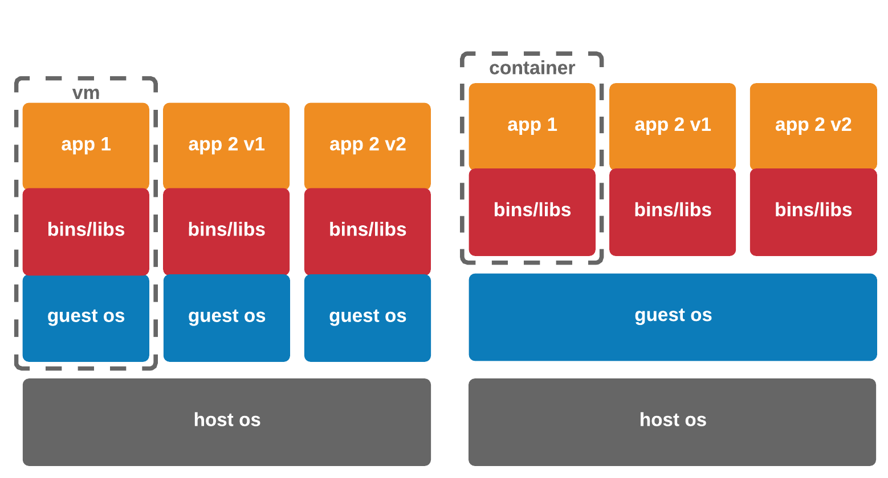
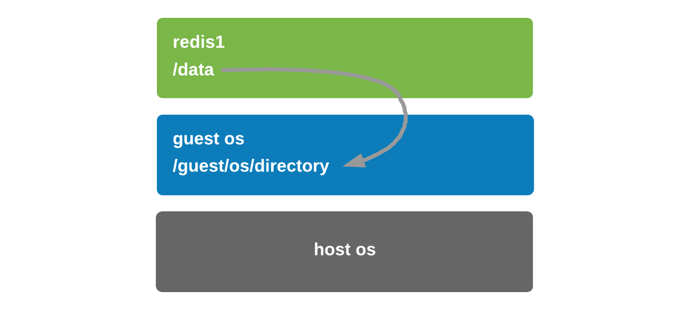
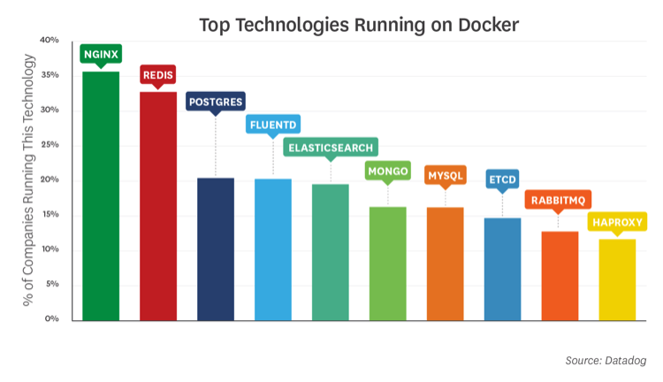

# Becoming a CNA Ninja 1: Why Containers, why now?

## What's in it for me?

We are going to take you, the humble reader from CNA zero, to CNA hero. We will introduce every feature and topic thoroughly, explain why it's needed and show it in action with practical, follow-along examples.

Over the course of this series we are going to build an application and move it, just as a developer would from inception to production readiness using Docker, Kubernetes and fully automated releases using CI/CD pipelines. Using advanced K8s primitives like Horizontal Pod Autoscaling, StorageClasses, LoadBalancers, StatefulSets and even dabbling in service meshes like Istio for A/B testing, tracing and canary releases (because let's be honest, everyone and their grandma will want to use our app and it just won't do if it's unreliable).

Sound complex? Well, you're in the right place then, because while it may seem daunting to begin with - following along with this series will explain everything clearly, justify and demonstrate its need in our kickass app.

Without further ado, let's get to making you a CNA Ninja!

## What is a container

A container, simply put, is a collection of just enough libraries, binaries and code to run your chosen application all held together in a tarball. They are a built on top of a [combination of a few linux primitives](https://ericchiang.github.io/post/containers-from-scratch/) namely; `namespaces`, `cgroups` and `chroot` the provide process, resource and filesystem isolation respectively.

Even though containers are the flavour of the moment they've been around in one form or another since the turn of the millennium through BSD Jails, Solaris Containers, OpenVZ and LXC which were all different interpretations of the same concept.

While most of us are (I hope) familiar with kernel-mode virtualization (VMs), OS-level virtualization for process and network isolation might be new to those of us who have been in the VM space for some time. So to better understand containers and where they fit in, let's start at the start - why do we want to use containers in the first place?

This can seem opaque in the beginning as these are challenges that a VM admin/sysadmin typically wouldn't have had to deal with and are generally specific to development, but you will no doubt be able to relate to some of the challenges presented by typical application development methods. With that said, let's explore the reasons behind the container movement. As far as I see it there are five main drivers behind the containerization of applications:

* Sharing a common kernel between applications, which reduces overhead
* While sharing a kernel, libraries are kept separate between containers greatly simplifying dependency chains
* Simplification of the application development and provisioning cycle because everything needed to run the app is "in a box" that is a known good.
* Rapid auto-scaling and scale-to-zero capabilities
* Perfect integration with Continuous Development / Continuous Integration pipelines

Some of the above may seem a little abstract at the moment, but we will get into them over the course of this learning series. Before we dive into the specifics of the above, let's take a look at how containers differ at an architectural level from VMs.

I made up this handy-dandy diagram that illustrates the levels of separation afforded by a vm compared to a container.



_Figure 1) Architectural differences between VMs and containers_

You will note that each VM has its own guest OS, bins, libraries and application, usually all deployed bespoke by-hand (think deploying MS SQL, installing .Net as a prerequisite, etc) even if not deployed by hand they can be deployed with a framework like vRA, Ansible, Puppet, Chef, et al.

This is not the case for the containers on the right hand side of the diagram. The app code, bins and libraries are all self-contained (heh), but the guest-os is shared between them. The separation and security boundary moves up the stack from the VM level to the OS-process level.

## Why do I need them?

What's the problem with doing things the "VM way" above I hear you ask? Easy - if (when) something changes inside the VM; a library is updated, application is updated, and it has unexpected effects on the way the application runs how easy is that to troubleshoot or roll back? How easy is it to know _something_ has changed without trawling logs?

The answer, quite simply, is that it's not. There is no "known good state" inside a VM, they are ever-changing and evolving over their life cycle and as such get a reputation of being "pets" with special temperaments and needs usually kept as tribal knowledge by the operations team.

Managing a VM goes like this; install a guest operating system, patch it, install the app prerequisites, then install the app and manage its life cycle, updating each component in turn, in the correct order and dealing with strange artifacts left behind as a result of upgrades from one version to another that are left on the guest os.

### How do containers help me solve these operational problems

Containers allow applications to be packaged as an immutable unit, deployed consistently, always in a known-good state. Then, when upgrade time comes - the container is destroyed and another is spun up in its place inheriting the state of the old container (more on this and volume mappings later).

The other nice thing is that containers are usually built and published in combination with `git` and tags or some sort of versioning tool, meaning that when a new version is spun up - we know because the container's metadata will have changed and we can simply roll back to the previous version!

That's not all of the benefits, but even at that it solves a lot of problems, if you ask me.

## It wouldn't be an intro without Docker

Containers and Docker are largely synonyms to the uninitiated, however they are different and there is a lot more to the container ecosystem than just Docker. To start with Docker, Inc. is the company that was spun out from the open source Docker project that originally defined the container "image" and "runtime" standards which are now managed as part of the Open Container Initiative (OCI) in order to prevent ecosystem fragmentation and lock-in.

I'll break down Docker's components into a few parts:

* Engine
* Image
* Runtime
* Command Line

### The Docker Engine (dockerd)

The Docker Engine also known by it's daemon name `dockerd` is the process that provides the "Docker" wrapper around the lower level components in the container stack, that make it easy to interface with, an API and a CLI.

### The Image

A container image (also known as an OCI image) is the distribution unit of a container - as mentioned back at the start, essentially a tarball with all the "stuff" in it that makes the app run. These can be arbitrarily tagged to distribute different versions of the application that can be run side-by-side with other containers instantiated from that image, or can be used to replace previous versions of the container instance.

### The Runtime (containerd)

A container runtime is the process that actually executes the processes within the container instance that is deployed.

### The CLI

All communications from the docker command-line tool `docker` are done via [the Docker Engine API](https://docs.docker.com/engine/api/v1.39/). The engine either binds to a local unix socket: `unix:///var/run/docker.sock` (for local machine use) or an IP address and port, in order to act as a remote host for access by other machines. The Docker Engine API is RESTful and can actually be used without the CLI, but the CLI is much more human-friendly than raw JSON.

## A practical example

I find the best way to learn things is by doing - now that we have the background and an understanding of containers and their various components, let's create one! You'll need to [install Docker](https://www.docker.com/get-started) and [git](https://git-scm.com/downloads) on your local machine for this, i'm using macOS but these commands are largely transferable to Linux and Windows.

I've set up a [GitHub repository](https://github.com/mylesgray/cna-ninja) we will use throughout this series to pull code and examples from, so to kick off let's navigate to a directory where we want to clone the repository into and clone it:

```sh
git clone https://github.com/mylesgray/cna-ninja.git
cd cna-ninja/
```

At this point you should have the following in your directory:

```sh
drwxr-xr-x  6 mylesgray  staff   192 12 Dec 18:31 01_Why-Containers
-rw-r--r--  1 mylesgray  staff  1067 12 Dec 18:28 LICENSE
-rw-r--r--  1 mylesgray  staff    39 12 Dec 18:28 readme.md
```

I've got a few versions of the app we're going to deploy within the `01_Why-Containers` folder; [`v1`](v1/) and [`v2`](v2/). Let's enter the `v1` directory and execute the sample application I built `app.py`, if you're a curious sort you can look at the code but simply, it takes some input text and generates a QR Code png file as an output.

```sh
cd 01_Why-Containers/v1
python src/app.py [YOUR TEXT HERE]
```

You'll find that probably didn't work because of missing libraries required by the script, so you'd have to run `pip install -r requirements.txt` (assuming you even have `pip` installed...) and then re-run the app. See how this is already a pain?

If it did work for you, great! You'll have a QR Code with the input text encoded in it in the `output` folder it generated. For those of you this didn't work for, fret-not. Our `v2` application will be a containerised version of the _exact_ same code, and if you followed my prerequisites and installed docker, you'll be off to the races!

So let's use docker build an image and run the exact same application without having to worry about any python dependencies or runtimes (this build command will take a little while):

```sh
cd 01_Why-Containers/v2
docker build -t qrcodegenerator .
```

Then we can execute the container to run the app, here we tell Docker to use the image that we just created called `qrcodegenerator` to create the container, and we pass the string we want `[YOUR TEXT HERE]` to the input of the container.

```sh
docker run qrcodegenerator [YOUR TEXT HERE]
```

That will have run beautifully, and given you a nice output, something along the lines of:

```sh
Created QR Code for: Myles
```

But where is the QR Code image file? Glad you asked, when a container creates files, they are created within the container instance - remember `chroot` from the start? That's what that helps to do, separate the files that the container can see from the host which is awesome for security, but sometimes we want our files to persist and exist outside the container - because when the container instance gets destroyed, so do all the files within it.

A core, fundamental paradigm of containers is that they must not store state in them (not any that you care about, anyway) because the container and everything inside it will be destroyed when it is removed or upgraded. A common misunderstanding by those unfamiliar with the technology is asking how they can edit files _within_ a container, when the question should infact be: _"how do I persist and change files outside the container?"_ - in that case where do we store the files we might want to change and have access to across container instances?

We can do this with [Volume Mounts](https://docs.docker.com/storage/volumes/), which mounts a container folder to one on the host, very similar to how file/folder sharing works within VMware Fusion and Workstation.

Because of this IO redirection, when we destroy the container, all the data is persisted on the host OS, so if we spin up a new version of the container with the same volume mapping - it simply inherits the state from that volume.



_Figure 2) Container volume mounted to host directory_

With that in mind let's adjust our `docker run` command to employ Volume Mounts and mount a folder on our machine - thereby proxying all filesystem output for `/app/output` within the container to a new folder `~/qrcodes` in our user's root directory, so the data is persisted:

```sh
docker run -v ~/qrcodes:/app/output qrcodegenerator [YOUR TEXT HERE]
```

If you go to your user root directory there will be a new folder there called `qrcodes` containing a png file that is your data encoded as a QR Code! Here's mine (pro-tip: open the camera app on your iOS or Android device and it will automatically read the code for you):

|||
|---|---|

_Table 1) Shows the generated QR from the sample app_

### Persisting storage with containers

We just now touched on one of the major pain points early adopters of containers stumbled upon - storage persistence. When destroying one container and spinning up a new version the entire container and all of its contents are destroyed - there is good reason for this.

Given we now know what containers are (immutable, pre-packaged applications) and that the majority of production containers require stateful storage (see Datadog survey below) the question moves from "what is a container?" to "how do I store the data?".

Containers started off running applications that were stateless, things like web servers of various flavours, applications that would process and input and generate an output but not necessarily store it anywhere. What we have seen over the last few years is applications that are inherently stateful; databases, logging and caching systems being run on containers more and more, why? Because by running your application in a container you guarantee cross-platform compatibility without worrying about dependency issues, configuration problems and such that plague hand-deployed apps on a guest OS.

In fact, recent [data from DataDog](https://www.datadoghq.com/docker-adoption/) a leading monitoring platform for cloud native applications shows that 7 of the top 10 applications deployed using containers are indeed stateful. Redis, Postgres, ElasticSearch, Mongo, MySQL, etcd and RabbitMQ are all stateful applications - and that state needs to be stored somewhere.



_Figure 3) The top ten most used containers - DataDog, 2018_

## Next time on the CNA Ninja Series

The above just highlights the importance of Volume Mounts just one concept in the container landscape, but like everything else - it's easy on your laptop, not so much at scale on larger systems - that topic as well as many more are in store for the next installment of the CNA Ninja series, so stay tuned, give [the repository](https://github.com/mylesgray/cna-ninja) a Watch to be alerted of the next release!