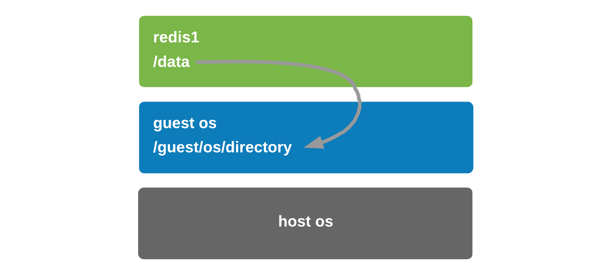
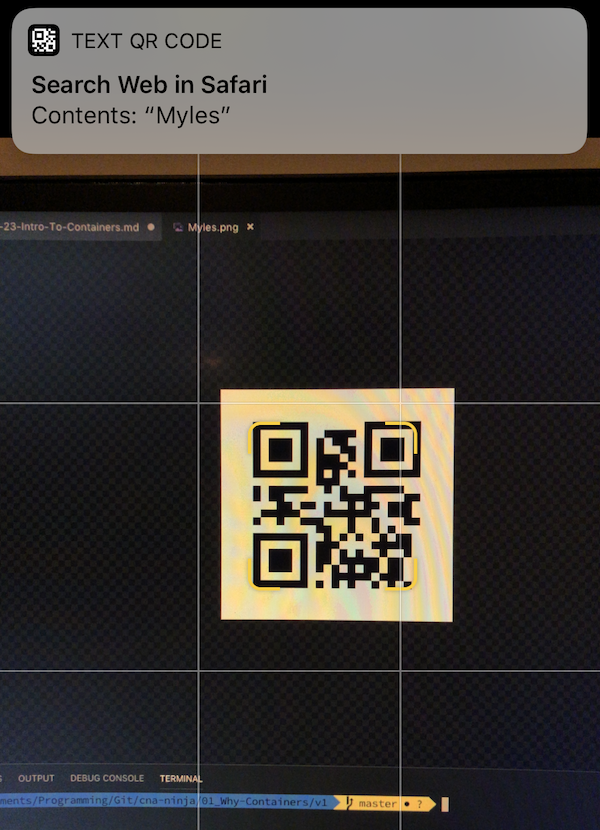
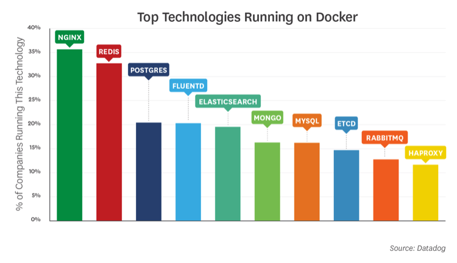

# Becoming a CNA Ninja 2: Your First Container

In the [last part](../01_Why-Containers/) of the series, we introduced the core concepts of containers, some history and how they work. This time, it's all hands-on! We are going to create a simple Python application that takes a text input and outputs a QR code with that data encoded in it - then we'll address some challenges that containerising this app solves by doing just that, creating our very own container image and deploying it.

## A practical example

I find the best way to learn things is by doing - now that we have the background and an understanding of containers and their various components, let's create one! You'll need to [install Docker](https://www.docker.com/get-started) and [git](https://git-scm.com/downloads) on your local machine for this, i'm using macOS but these commands are largely transferable to Linux and Windows.

I've set up a [GitHub repository](https://github.com/mylesagray/cna-ninja) we will use throughout this series to pull code and examples from, so to kick off let's navigate to a directory where we want to clone the repository into and clone it:

```sh
git clone https://github.com/mylesagray/cna-ninja.git
cd cna-ninja/
```

At this point you should have the following in your directory:

```sh
$ ls -l
drwxr-xr-x  3 mylesgray  staff    96 14 Dec 14:38 00_Tools
drwxr-xr-x  4 mylesgray  staff   128 22 Jan 17:58 01_Why-Containers
drwxr-xr-x  5 mylesgray  staff   160 22 Jan 17:58 02_First-Container
drwxr-xr-x  5 mylesgray  staff   160 13 Dec 00:28 03_Scaling-Out
-rw-r--r--  1 mylesgray  staff  1067 12 Dec 18:28 LICENSE
-rw-r--r--  1 mylesgray  staff  1014 22 Jan 17:57 readme.md
```

### Version 1

I've got a few versions of the app we're going to deploy within the `01_Why-Containers` folder; [`v1`](v1/) and [`v2`](v2/). Let's enter the `v1` directory and execute the sample application I built [`app.py`](v1/src/app.py), if you're a curious sort you can look at the code but simply, it takes some input text and generates a QR Code png file as an output.

```sh
python 01_Why-Containers/v1/src/app.py [YOUR TEXT HERE]
```

_You'll find that probably didn't work because of missing libraries required by the script._

So you'd have to run `pip install -r requirements.txt` (assuming you even have `pip` installed...) and then re-run the app. See how this is already a pain?

If it did work for you, great! You'll have a QR Code with the input text encoded in it in the `output` folder it generated. For those of you this didn't work for, fret-not. Our `v2` application will be a containerised version of the _exact_ same code, and if you followed my prerequisites and installed docker, you'll be off to the races!

### Version 2

So let's use Docker to build an image and run the exact same application without having to worry about any python dependencies or runtimes.

I am going to introduce the `Dockerfile` here, this is what tells Docker how to build the image for a container that we can then deploy from. You will find one pre-created at [`v2/Dockerfile`](v2/Dockerfile) and open it in your editor of choice (as in [Part 0](../00_Tools/) - I use Visual Studio Code):

```sh
code 01_Why-Containers/v2/Dockerfile
```

I encourage you to take a look through the Dockerfile code, it is very easy to understand and will help you get a grip of it for creating your own containers. I have commented the code below to fully explain what each line does:

```Dockerfile
# Set the base image to build from as the official Python 3 image
FROM python:3

# Copy the python libraries requirements.txt file for our app, from our computer's file system, to the container's root (/) directory
COPY requirements.txt /

# Install the Python requirements in the container
RUN pip install -r /requirements.txt

# Copy our app's source code from the src/ directory on our local machine into the container's /app folder
COPY src/ /app

# Set the working directory of the container's entrypoint (what directory the ENTRYPOINT command executes from) to be the /app folder we just copied the source code to. N.B: This command could be omitted and the ENTRYPOINT line changed to 'ENTRYPOINT ["python", "/app/app.py"]' and achieve the same effect
WORKDIR /app

# Execute the application with python
ENTRYPOINT ["python", "app.py"]
```

At this point we are ready to build our first Docker container! (The build command will take a little while). The command below will tell Docker to build an image using the `Dockerfile` we just looked at, and name the container image `qrcodegenerator`:

```sh
docker build -f 01_Why-Containers/v2/Dockerfile -t qrcodegenerator .
```

Then we can execute the container to run the app, here we tell Docker to use the image that we just created called `qrcodegenerator` to create the container, and we pass the string we want `[YOUR TEXT HERE]` to the input of the container.

```sh
docker run qrcodegenerator [YOUR TEXT HERE]
```

That will have run beautifully, and given you a nice output, something along the lines of:

```sh
Created QR Code for: Myles
```

_But where is the QR Code image file?_

Glad you asked. 

## Storing state

When a container creates files, they are created within the container instance itself - remember `chroot` from the start? That's what `chroot` helps to do, separate the files that the container can see from the files the host can see, which is awesome for security, but sometimes we want our files to persist and exist outside the container - because when the container instance gets destroyed, so do all the files within it.

A core, fundamental paradigm of containers is that they are ephemeral, and therefore must not store state in them (not any that you care about, anyway) because the container and everything inside it will be destroyed when it is removed or upgraded.

A common misunderstanding by those unfamiliar with the technology is asking how they can edit files _within_ a container (like, can I SSH to it to update things), when the question should infact be: _"how do I persist and change files outside the container?"_.

So, how do we store the files we might want to change and persist across container instances?

## Volume Mounts

We can do this with [Volume Mounts](https://docs.docker.com/storage/volumes/), which will mount a folder within the container to a folder on the host, very similar to how file/folder sharing works between a VM and the host OS in VMware Fusion or Workstation.

Because of this IO redirection, when we destroy the container, all the data is persisted on the host OS, so if we spin up a new version of the container with the same volume mapping - it simply inherits the state from that volume.


_(Figure 1) Container volume mounted to host directory_

## Putting it into practise

With that in mind let's adjust our `docker run` command to employ Volume Mounts and mount a folder on our host machine - thereby proxying all filesystem output for `/app/output` within the container to a new folder `qrcodes` in our user's home directory, so the data is persisted:

```sh
docker run -v ~/qrcodes:/app/output qrcodegenerator [YOUR TEXT HERE]
```

If you go to your user home directory there will be a new folder there called `qrcodes` containing a png file that is your data encoded as a QR Code! Here's mine (pro-tip: open the camera app on your iOS or Android device and it will automatically read the code for you):

|||
|---|---|

## Persisting storage with containers

We just now touched on one of the major pain points early adopters of containers stumbled upon - storage persistence. When destroying one container and spinning up a new version the entire container and all of its contents are destroyed - there is good reason for this.

Given we now know what containers are (immutable, pre-packaged applications) and that the majority of production containers require stateful storage (see Datadog survey below) the question moves from "what is a container?" to "how do I store the data?".

Containers started off running applications that were stateless, things like web servers of various flavours, applications that would process and input and generate an output but not necessarily store it anywhere.

What we have seen over the last few years is applications that are inherently stateful; databases, logging and caching systems being run on containers more and more, why? Because by running your application in a container you guarantee cross-platform compatibility without worrying about dependency issues, configuration problems and such that plague hand-deployed apps on a guest OS.

In fact, recent [data from DataDog](https://www.datadoghq.com/docker-adoption/) (a leading monitoring platform for cloud native applications) shows that 7 of the top 10 applications deployed using containers are indeed stateful. Redis, Postgres, ElasticSearch, Mongo, MySQL, etcd and RabbitMQ are all stateful applications - and that state needs to be stored somewhere.



_Figure 3) The top ten most used containers - DataDog, 2018_

## Next time on the CNA Ninja Series

The above just highlights the importance of Volume Mounts just one concept in the container landscape, but like everything else - it's easy on your laptop, not so much at scale on larger systems - that topic as well as many more are in store for the next installment of the CNA Ninja series, so stay tuned, give [the repository](https://github.com/mylesagray/cna-ninja) a "Watch" or [follow me on Twitter](https://twitter.com/mylesagray) to be alerted of the next release!